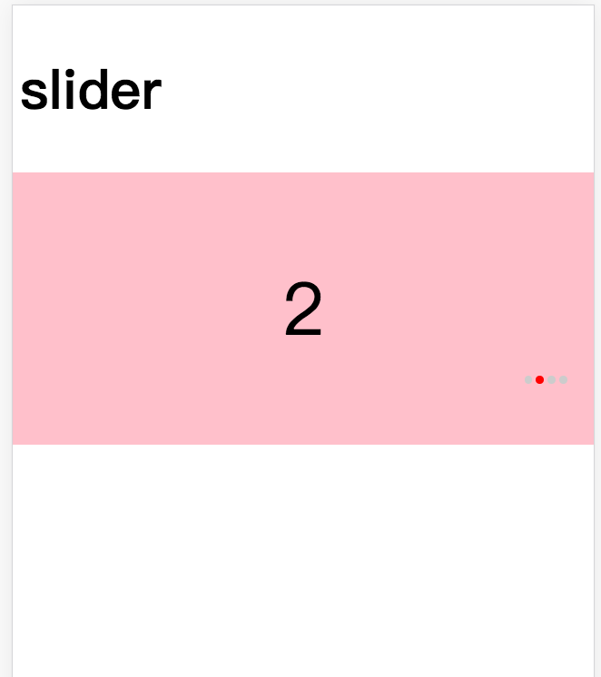

## vue-slider

a vue slider component

### Quickstart
```javascript
require('we-vue-slider/dist/vue-slider.css');

// in ES6 modules
import { slider, sliderItem } from 'we-vue-slider';

// in CommonJS
const { slider, sliderItem } = require('we-vue-slider');

// in Global variable
const { slider, sliderItem } = VueSwiper;

Vue.component('c-slider',slider);
Vue.component('c-sliderItem',sliderItem);
```
```html
 <c-slider class="slider" :loop="true">
    <c-slider-item v-for="n in list" :key="'slider' + n">
        <div class="slide">{{n}}</div>
    </c-slider-item>
</c-slider>
```

### Params

`slider`
-  `speed`: the scroll speed every swipe
-  `loop` : whether scroll loop, default is true 
-  `auto` : whether scroll autoplay,defalut is true

### Preview

